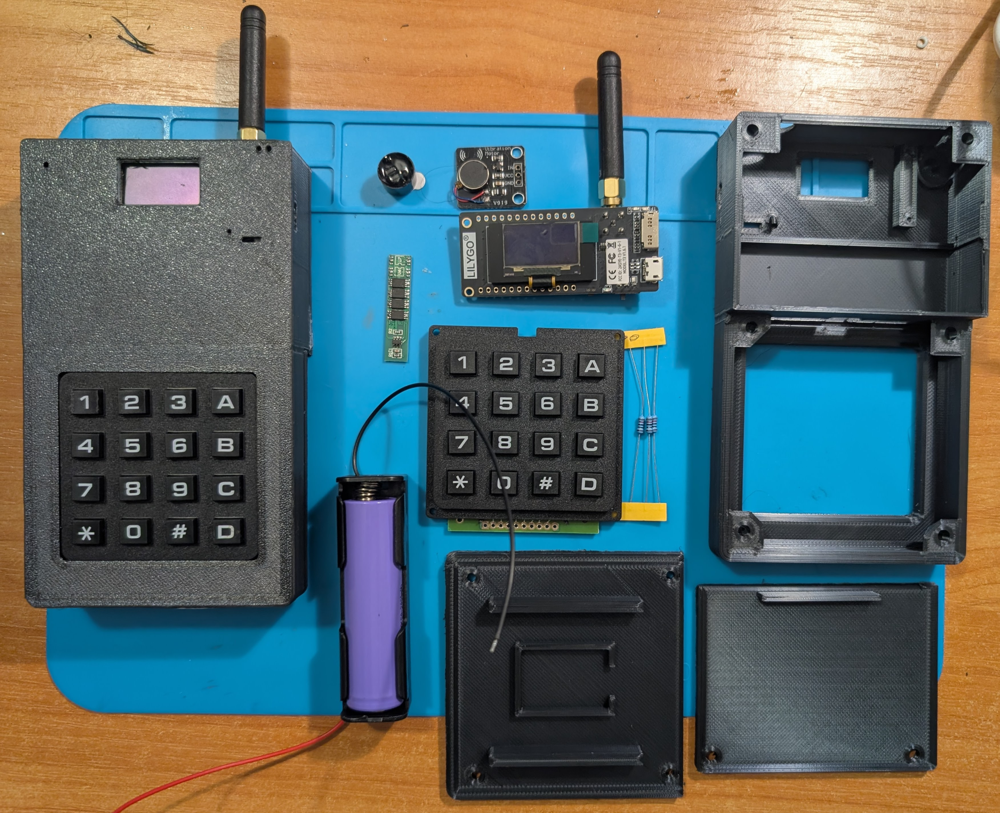
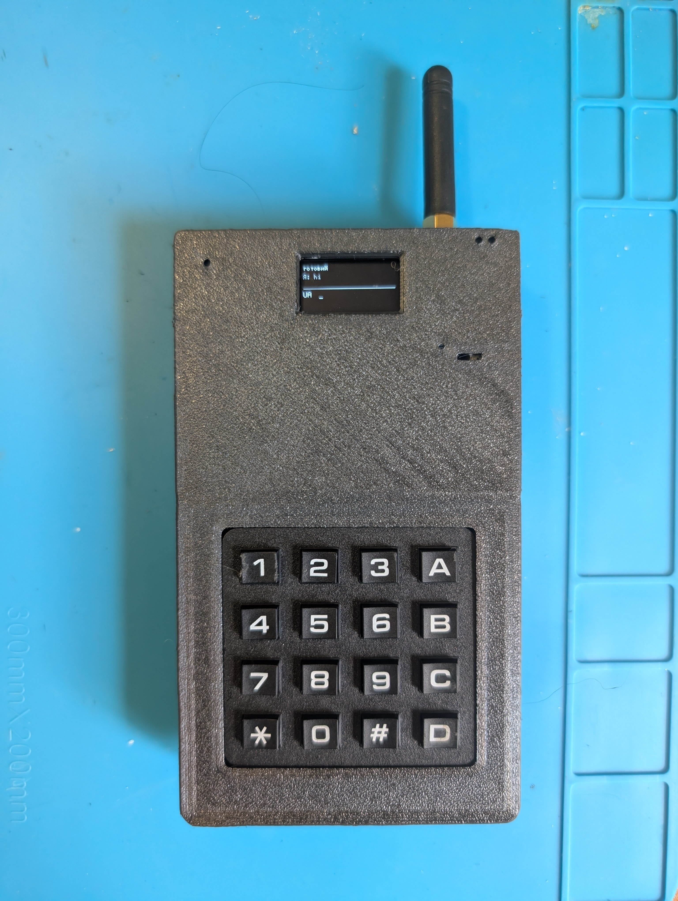

# LoRa Messenger

https://github.com/user-attachments/assets/9752c168-1441-4f8f-9525-f6e81b044c81






[Модель корпусу на Tinkercad](https://www.tinkercad.com/things/bcOIGlIjFoJ-lorattgo-case)

---

# Українською

Пара автономних текстових месенджерів на платах LilyGO TTGO LoRa32 V2.1 (T3 V1.6.1). Два пристрої, одна спільна прошивка, шифровані повідомлення через LoRa на 868 МГц — без мобільної мережі, без інтернету, без жодної інфраструктури.

Текст набирається на матричній клавіатурі 4×4 мультитапом, як на кнопкових телефонах. Повідомлення показуються на вбудованому OLED і зберігаються у флеші, тож переживають перезавантаження.

## Залізо

| Компонент | Примітки |
|---|---|
| LilyGO TTGO LoRa32 V2.1 (T3 V1.6.1) | ESP32 + SX1276, 868 МГц, OLED розпаяний |
| Матрична клавіатура 4×4 |
| Пасивний п'єзо-бузер |
| Модуль вібромотора |
| Акумулятор 18650 | 
| Плата захисту BMS | 
| 3× резистор 10 кОм | підтяжки для GPIO 34/36/39 |

**Завжди прикручуй антену перед вмиканням.** Передача без навантаження псує підсилювач.

## Збірка

```bash
pio run -e node_a -t upload    # перший пристрій
pio run -e node_b -t upload    # другий пристрій
```

Обидва пристрої отримують однаковий код, середовища відрізняються лише ідентифікаторами вузлів. Діагностичні середовища для налагодження заліза:

```bash
pio run -e keytest -t upload -t monitor    # матриця клавіатури
pio run -e buzztest -t upload -t monitor   # бузер
pio run -e vibrotest -t upload -t monitor  # вібромотор
```

Перед збіркою заміни `CRYPTO_KEY` в `include/config.h`. Ключ у репозиторії публічний і навмисно однаковий на обох пристроях — постав свій і тримай його однаковим на обох.

## Керування

`C` перемикає три екрани по колу: Чат → Історія → Меню.

### Чат

| Клавіша | Дія |
|---|---|
| `2`–`9` | літери, тисни повторно для наступної |
| `0` | пробіл, далі `0` |
| `1` | `. , ! ?` далі `1` |
| `A` | розкладка UA / EN |
| `B` | очистити чернетку |
| `*` | стерти символ |
| `#` | надіслати |
| `D` (утримати 2.5 с) | вимкнути пристрій |

Пауза між натисками фіксує поточну літеру. Сама цифра — остання позиція в кожному циклі.

**Розкладки**

| Клавіша | UA | EN |
|---|---|---|
| `1` | . , ! ? 1 | . , ! ? 1 |
| `2` | а б в г 2 | a b c 2 |
| `3` | ґ д е є 3 | d e f 3 |
| `4` | ж з и і 4 | g h i 4 |
| `5` | ї й к л 5 | j k l 5 |
| `6` | м н о п 6 | m n o 6 |
| `7` | р с т у 7 | p q r s 7 |
| `8` | ф х ц ч 8 | t u v 8 |
| `9` | ш щ ь ю я 9 | w x y z 9 |
| `0` | пробіл 0 | пробіл 0 |

### Історія

| Клавіша | Дія |
|---|---|
| `2` / `8` | гортати |
| `*` | назад у чат |

### Меню

| Клавіша | Дія |
|---|---|
| `2` / `8` | рухати курсор |
| `#` | виконати |
| `*` | вийти в чат |

| Пункт | Що робить |
|---|---|
| Ping | перевірка зв'язку, показує затримку й рівень сигналу з обох боків |
| Дальність | десять запитів поспіль, статистика доставки й розкид RSSI |
| Повний сон | увімк/вимк — коли увімкнено, радіо теж засинає і повідомлення не приходять |
| Про пристрій | spreading factor, потужність, напруга батареї |
| Стерти історію | видаляє збережені повідомлення |
| Вимкнути | одразу йде в глибокий сон |

## Екрани

**Чат** — основний. Верхній рядок показує RSSI, SNR і тривалість останнього пакета в ефірі; до першого пакета там параметри радіо. Нижче — останнє повідомлення з переносом на два рядки. Під розділювачем — поточна розкладка й поле вводу на два рядки, у якому видно хвіст набраного.

Статуси — *відправлено*, *доставлено*, *ефір зайнятий 4с* — ненадовго перекривають рядок сигналу, потім він повертається.

**Історія** зберігає останні 20 повідомлень зі скролом, дані лежать у NVS. Відправлені потрапляють у стрічку лише після підтвердження, тож журнал показує те, що справді дійшло.

**Меню** — список із п'яти пунктів і лічильником позиції в заголовку.

## Як це працює

**Протокол.** Кожен пакет має відкритий заголовок (сигнатура, версія, відправник, отримувач, тип, сесія, номер) і зашифроване AES-128-CTR корисне навантаження. Заголовок лишається читабельним, щоб відсіювати чужий трафік і відповідати ACK, не розшифровуючи все підряд; сам текст — ні. Контрольна сума всередині шифру виявляє розбіжність ключів.

Поле сесії — випадкове число при кожному старті. Без нього лічильник після ресету починався б з одиниці й повторно використовував ті самі блоки — класичний спосіб зламати режим CTR.

**Доставка.** Повідомлення підтверджуються, повторів до трьох. Дублікати підтверджуються ще раз, але в стрічці не з'являються — це покриває втрачений ACK.

**Ефірний бюджет.** Діапазон 868 МГц дозволяє 1% часу в ефірі. Після кожної передачі радіо мовчить у сто разів довше за тривалість пакета, і інтерфейс показує, скільки лишилося чекати. На SF7 це близько шести секунд між повідомленнями.

**Прийом** працює безперервно через переривання на DIO0, а не блокуючим викликом, який губив би пакети між приймальними вікнами.

**Живлення.** Через п'ять хвилин бездіяльності гасне екран і процесор скидає частоту до 80 МГц, але радіо продовжує слухати — вхідне повідомлення піднімає екран зі звуком і вібрацією. Опційний глибокий сон через тридцять хвилин вимикає й радіо; будять клавіші `*`, `0`, `#`, `D`.

## Структура проєкту

```
platformio.ini
include/config.h          піни, параметри радіо, налаштування
src/main.cpp              зв'язування модулів
src/*_test.cpp            діагностика заліза
lib/link/                 формат пакета, шифрування, ACK, duty cycle
lib/ui/                   екрани OLED
lib/power/                режими сну
lib/keypad/               сканування матриці
lib/history/              кільцевий буфер у NVS
lib/input/                мультитап
lib/periph/               бузер, вібрація, батарея
```

Модулі спілкуються через колбеки, а не лізуть один в одного: `link` нічого не знає про дисплей, `ui` нічого не знає про радіо.


## Обмеження

Шифрування дає лише конфіденційність, автентифікації немає — теоретично зловмисник може підмінити біти шифротексту. Воно захищає від сусіда з таким самим модулем, а не від цілеспрямованої атаки.

Годинника немає навмисно. Повідомлення не мають позначок часу, бо на платі немає RTC з резервною батарейкою.

Глибокий сон не знеструмлює плату повністю — регулятор, зарядний чіп і дільник напруги беруть один-два міліампери. Для довгого зберігання вистави в Off живлення акумулятора.

Дальність залежить від spreading factor і оточення. SF7 дає коротке заповнення ефіру і прийнятну паузу; SF12 дістає значно далі, але кожен пакет займає ефір на секунди, і обов'язкова тиша розтягується на хвилини.

### Розводка

Гребінка клавіатури має 10 отворів, крайні два не використовуються.

| Отвір | Лінія | GPIO |
|---|---|---|
| 2 | C1 | 15 |
| 3 | C2 | 34 + 10 кОм до 3.3 В |
| 4 | C3 | 36 (S_VP) + 10 кОм до 3.3 В |
| 5 | C4 | 39 (S_VN) + 10 кОм до 3.3 В |
| 6 | R1 | 12 |
| 7 | R2 | 13 |
| 8 | R3 | 14 |
| 9 | R4 | 25 |

| Периферія | GPIO | Примітки |
|---|---|---|
| Бузер | 4 | другий вивід на GND |
| Вібромотор, сигнал | 2 | |
| Вібромотор, живлення | від батареї | не 3.3 В — мотору потрібно 3.7 В для старту |
| Замір батареї | 35 | дільник 1:2 на платі |

GPIO 34, 36 і 39 працюють тільки на вхід і не мають внутрішніх підтяжок — звідси зовнішні резистори.

GPIO 2 — strapping-пін, у момент ресету має бути низьким. Вхід драйвера мотора має високий опір і зазвичай не заважає, але якщо прошивка почне падати з *wrong boot mode detected*, додай резистор 10 кОм від GPIO 2 до GND. Так само, якщо плата перезавантажується з brownout при вмиканні мотора, допоможе конденсатор 100–220 мкФ по живленню мотора. На зібраних пристроях нічого з цього не знадобилося.

---

# English

A pair of off-grid text messengers built on LilyGO TTGO LoRa32 V2.1 (T3 V1.6.1) boards. Two devices, one identical firmware, AES-encrypted messages over 868 MHz LoRa — no cell network, no internet, no infrastructure of any kind.

Text is typed on a 4×4 matrix keypad using multi-tap, the way it worked on phones before touchscreens. Messages are shown on the onboard OLED and stored in flash, so they survive a reboot.

## Hardware

| Part | Notes |
|---|---|
| LilyGO TTGO LoRa32 V2.1 (T3 V1.6.1) | ESP32 + SX1276, 868 MHz, OLED soldered |
| 4×4 matrix keypad | 8 signal lines |
| Passive piezo buzzer | 2 wires, no driver board |
| Coin vibration motor module | with onboard driver transistor |
| 18650 cell | protected cell recommended |
| 3× 10 kΩ resistor | pull-ups for GPIO 34/36/39 |

### Wiring

The keypad ribbon has 10 holes; the outer two are unused.

| Hole | Line | GPIO |
|---|---|---|
| 2 | C1 | 15 |
| 3 | C2 | 34 + 10 kΩ to 3.3 V |
| 4 | C3 | 36 (S_VP) + 10 kΩ to 3.3 V |
| 5 | C4 | 39 (S_VN) + 10 kΩ to 3.3 V |
| 6 | R1 | 12 |
| 7 | R2 | 13 |
| 8 | R3 | 14 |
| 9 | R4 | 25 |

| Peripheral | GPIO | Notes |
|---|---|---|
| Buzzer | 4 | other leg to GND |
| Vibration motor signal | 2 | |
| Vibration motor power | battery | not 3.3 V — the motor needs 3.7 V to start |
| Battery sense | 35 | onboard 1:2 divider |

GPIO 34, 36 and 39 are input-only and have no internal pull-ups, hence the external resistors.

GPIO 2 is a strapping pin and must read low at reset. The motor driver input is high-impedance and usually leaves it alone, but if flashing starts failing with *wrong boot mode detected*, add a 10 kΩ resistor from GPIO 2 to GND. Likewise, if the board resets with a brownout when the motor kicks in, a 100–220 µF capacitor across the motor supply fixes it. Neither was needed on the units built so far.

**Always attach the antenna before powering up.** Transmitting into an open port damages the PA.

## Build

```bash
pio run -e node_a -t upload    # first unit
pio run -e node_b -t upload    # second unit
```

Both units run identical code; the environments differ only in node IDs. Diagnostic environments for bringing up new hardware:

```bash
pio run -e keytest -t upload -t monitor    # keypad matrix
pio run -e buzztest -t upload -t monitor   # buzzer
pio run -e vibrotest -t upload -t monitor  # vibration motor
```

Set your own `CRYPTO_KEY` in `include/config.h` before building. The key in the repository is public and identical on both units by design — change it, and keep it the same on both.

## Controls

`C` cycles through the three screens: Chat → History → Menu.

### Chat

| Key | Action |
|---|---|
| `2`–`9` | letters, press repeatedly to cycle |
| `0` | space, then `0` |
| `1` | `. , ! ?` then `1` |
| `A` | switch layout UA / EN |
| `B` | clear the draft |
| `*` | delete one character |
| `#` | send |
| `D` (hold 2.5 s) | power off |

Pausing between presses commits the current letter. The digit itself is the last option in every cycle.

**Layouts**

| Key | UA | EN |
|---|---|---|
| `1` | . , ! ? 1 | . , ! ? 1 |
| `2` | а б в г 2 | a b c 2 |
| `3` | ґ д е є 3 | d e f 3 |
| `4` | ж з и і 4 | g h i 4 |
| `5` | ї й к л 5 | j k l 5 |
| `6` | м н о п 6 | m n o 6 |
| `7` | р с т у 7 | p q r s 7 |
| `8` | ф х ц ч 8 | t u v 8 |
| `9` | ш щ ь ю я 9 | w x y z 9 |
| `0` | space 0 | space 0 |

### History

| Key | Action |
|---|---|
| `2` / `8` | scroll |
| `*` | back to chat |

### Menu

| Key | Action |
|---|---|
| `2` / `8` | move cursor |
| `#` | activate |
| `*` | back to chat |

| Item | What it does |
|---|---|
| Ping | round-trip check, reports RTT and signal strength on both ends |
| Range | ten pings in a row, reports success rate and RSSI spread |
| Deep sleep | on/off — when on, the radio sleeps too and messages stop arriving |
| Device info | spreading factor, TX power, battery voltage |
| Clear history | wipes stored messages |
| Power off | enters deep sleep immediately |

## Screens

**Chat** is the default. The top line shows RSSI, SNR and the time the last packet spent on air; before the first packet it shows the radio configuration instead. Below it is the most recent message, wrapped across up to two lines. Under the divider, the current layout and a two-line input field showing the tail of what you are typing.

Status messages — *sent*, *delivered*, *air busy 4s* — briefly replace the signal line, then it returns.

**History** holds the last 20 messages in a scrollable list, persisted to NVS. Sent messages appear only after they have been acknowledged, so the log reflects what actually arrived.

**Menu** is a five-item list with a position counter in the header.

## How it works

**Protocol.** Every packet carries a plaintext header (magic, version, source, destination, type, session, sequence) followed by an AES-128-CTR encrypted payload. The header stays readable so a unit can filter foreign traffic and acknowledge without decrypting everything first; the message body does not. A checksum inside the encrypted section detects a key mismatch.

The session field is a random value generated at boot. Without it the sequence counter would restart from one after every reset and reuse counter blocks — the classic way to break CTR mode.

**Delivery.** Messages are acknowledged and retried up to three times. Duplicate sequence numbers are acknowledged again but not shown twice, which covers a lost ACK.

**Duty cycle.** The 868 MHz band allows 1% air time. After every transmission the radio stays silent for a hundred times the packet duration, and the UI shows how long is left. At SF7 that is roughly six seconds between messages.

**Reception** runs continuously through a DIO0 interrupt rather than a blocking receive call, which would drop packets arriving between receive windows.

**Power.** After five minutes idle the display turns off and the CPU drops to 80 MHz, but the radio keeps listening — an incoming message wakes the screen with sound and vibration. Optional deep sleep after thirty minutes shuts down the radio as well; keys `*`, `0`, `#` and `D` wake the device.

## Project layout

```
platformio.ini
include/config.h          pins, radio parameters, tuning
src/main.cpp              wiring between modules
src/*_test.cpp            hardware bring-up sketches
lib/link/                 packet format, encryption, ACK, duty cycle
lib/ui/                   OLED screens
lib/power/                sleep states
lib/keypad/               matrix scanning
lib/history/              ring buffer in NVS
lib/input/                multi-tap text entry
lib/periph/               buzzer, vibration, battery
```

Modules communicate through callbacks rather than reaching into each other; `link` knows nothing about the display, `ui` knows nothing about the radio.

## Notes and limitations

Encryption is confidentiality only; there is no authentication, so a determined attacker could tamper with ciphertext. It protects against a neighbour with the same hardware listening in, not against a targeted attack.

The clock is absent by design. Messages carry no timestamps because the board has no RTC with a backup cell.

Deep sleep does not fully power down the board — the regulator, charger and voltage divider keep drawing a milliamp or two. For long-term storage, remove the cell.

Range depends on spreading factor and surroundings. SF7 gives short air time and a duty cycle you can live with; SF12 reaches much further but each packet occupies the air for seconds, which pushes the mandatory silence into minutes.